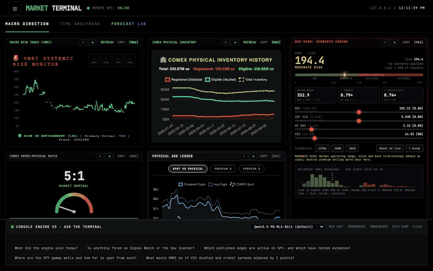

# Market Terminal — a self-hosted market dashboard

[](https://github.com/vladbondarenko97/market-terminal/actions/workflows/test.yml)
[](LICENSE)



It ships with its own test suite: 266 tests that need no network, no keys and no data, run on every push. See
[Tests](#tests). Clone it, run it once and it starts tracking on your own data: nothing of anyone else's is
included. See [Run it](#run-it).

A Python + SQLite system that collects market data twice a day, stores every raw response, computes a set of
quantitative models, and serves the result as a web terminal, an email report and a phone alert. It runs on one Mac
with no cloud services.

It has two parts:

| Part | What it is | Entry point |
|---|---|---|
| **Pipeline** | A batch run: collect → capture → snapshot → render → deliver. Runs on a schedule or by hand, then exits. | `python main_pipeline.py run` |
| **Terminal** | A Flask server with a browser UI. It shows what the pipeline stored, plus some live option and news panels. | `python options_whale/api_router.py` |

> Not financial advice. Every model output is a probability or an estimate, and each card states its own caveats.

## Documentation

| If you want to… | Read |
|---|---|
| Install it, run it, schedule it, fix a failed run | [Operations](docs/operations.md) |
| Fill in `.env` or change the data folder or port | [Configuration](docs/configuration.md) |
| Use the terminal | [Terminal](docs/terminal.md) and [Forecast Lab](docs/forecast-lab.md) |
| Understand the code before changing it | [Architecture](docs/architecture.md) (design rules, full repository map) |
| Know what is stored where | [Data](docs/data.md) |
| Call the HTTP API | [API](docs/api.md) |
| See why a value changed between runs | [Value changes](docs/value-changes.md) |
| Check for a known bug | [Known issues](docs/known-issues.md) |
| Work on the code as an AI agent | [AGENTS.md](AGENTS.md) |
| Set up the optional upload receiver | [server/README.md](server/README.md) |

## Run it

No account and no key is needed for the first run. Tested on Python 3.13 and 3.14.

```bash
git clone https://github.com/vladbondarenko97/market-terminal.git
cd market-terminal
python3 -m venv .venv && .venv/bin/pip install -r requirements.txt

.venv/bin/python main_pipeline.py run --no-deliver --no-cme-browser   # first run, 1 to 2 minutes; sends nothing
.venv/bin/python options_whale/api_router.py                          # then open http://localhost:8080
```

The first run creates `CME_Data/` inside the project folder: one SQLite database plus a folder per day. It is
git-ignored, so your data never reaches a commit. Every later run adds to it; the scorecard and the history charts
fill in as the days pass.

On a Mac, `./setup.sh` does the install for you and also keeps the terminal running as a login service with a
menu bar icon. `./setup.sh --schedule` (on **one** Mac only) runs the pipeline three times a trading day and checks
the rule alerts every 15 minutes of the session. `setup.sh` is safe to re-run; `./setup.sh --help` lists every
option. Details: [Operations](docs/operations.md).

### What each key adds

Everything is optional. Copy `.env.example` to `.env` (`setup.sh` does it) and fill in what you want;
[Configuration](docs/configuration.md) lists every setting and what happens when it is empty.

| You add | Cost | You get |
|---|---|---|
| nothing | free | Forecast Lab (models, Signal Watch, Day Scanner, Edge Lab), Time Arbitrage, dealer gamma, the Shanghai–COMEX spread, engine tickets |
| `FRED_API_KEY` | free | The VMRI risk index and War Room, Fed liquidity, the macro inputs of Forecast Lab cards 5 to 7 |
| A CME account (`main_pipeline.py cme-login`) | free | COMEX volume files, inventory and the paper:physical ratio |
| `EBAY_APP_ID`, `EBAY_CERT_ID` | free | Silver Eagle premiums over spot |
| `NTFY_URL`, the email settings | free | The phone push, the rule alerts and the email report |
| A local model server (Ollama, oMLX, LM Studio) | free | The console: ask the terminal in plain words |
| `DATABENTO_API_KEY` | paid | Dark-pool block flow |

### Your data, not mine

The repository holds code only. It does not include a database or a sample run, and it should not: several
sources (CME, Databento, eBay) have their own terms on passing their data on, and a stale snapshot would tell
you less than your own first run. If you fork this, keep `CME_Data/` and `.env` out of git the same way.

## What you get

- **Three runs a day** on NYSE trading days (09:31, 12:30 and 15:45 ET; no afternoon run on 13:00 ET early closes) on the
  Mac that owns the schedule. Each run stores
  every provider response, computes the models and commits one immutable snapshot.
- **The terminal**, three tabs:
  - **Macro Direction**: VMRI macro risk index and War Room scenarios, COMEX inventory and paper:physical ratio,
    eBay Silver Eagle premiums, dealer gamma (GEX), dark-pool block flow, catalyst calendar, news sentiment, Fed
    liquidity, Shanghai–COMEX spread and the Engine Positions card.
  - **Time Arbitrage**: option analytics for a ticker: dealer positioning, IV vs realised volatility, term
    structure, a probability matrix and an option chain explorer with a Black-Scholes calculator.
  - **Forecast Lab**: eleven model cards for SPY or SLV: market-implied range, volatility forecast, trend/CTA,
    positioning (COT), silver fair value, macro regime, calendar effects, mechanical flows, a forecast scorecard,
    diesel & refining (with a Texas refinery outage tracker) and EIA inventories. Three rule cards sit beside
    them: **Signal Watch** (every trigger, fired or waiting, with what to do), **Day Scanner** (a dip-in-an-uptrend
    rule on your own ticker list) and **Edge Lab** (seven published edges tested on any ticker's own history).
- **Evidence before action**: a rule only says "buy" when its own history clears a fixed test (enough cases, the
  same sign in both halves of the record, a t-statistic of at least 2). Otherwise the card says there is no
  measured edge.
- **Rule alerts**: every 15 minutes of the session, a trigger that goes from waiting to fired is pushed to your
  phone once.
- **Console**: ask in plain words ("where are the gamma walls?"). A model on your own machine answers from the
  terminal's read-only routes; nothing leaves the computer.
- **Execution engine and position tracking**: each run outputs a trade ticket (or CASH). Tickets are stored and
  marked at +1 day, +1 week and +2 weeks.
- **Delivery**: an email report, a phone push (ntfy) and an optional upload to your own web server. The exact email
  is saved before it is sent.
- **Replay**: any past run can be re-rendered from its snapshot with no network: `main_pipeline.py replay`.
- **Menu bar control**: a macOS menu bar icon shows whether the server is up and starts, stops or restarts it.

## Tests

266 tests, about 30 seconds, plain `unittest`. They use no network, no credentials and a scratch data folder, so
they pass on a fresh clone and in CI (Ubuntu, on every push):

```bash
.venv/bin/python -m unittest discover -s tests
for f in options_whale/static/*.js; do node --check "$f"; done    # syntax check of the terminal's scripts
```

| File | Tests | What it protects |
|---|---|---|
| `test_api.py` | 84 | Every terminal route: `/help` lists them all, bad parameters are refused, run control, gamma, dark pool, War Room and option maths, JSON that never carries `NaN` |
| `test_v2.py` | 53 | The acceptance rules: a failed source is reported and never shown as zero, outputs match the snapshot, the Forecast Lab, the evidence test behind the rule cards, and a console that can only read |
| `test_pipeline_fixes.py` | 41 | Settings parsing, the data folder rules, the run lock, exit codes, delivery results, and one offline run end to end |
| `test_core_fixes.py` | 39 | Storage that only ever adds, request limits, CME downloads, engine tickets and their marks, the forecast scorecard, models with missing inputs |
| `test_ui.py` | 31 | The page without a browser: every element a script touches exists, the menu drawer, the phone layout |
| `test_schedule.py` | 18 | NYSE holidays and early closes, which scheduled runs are accepted, the launchd times `setup.sh` writes |

`scripts/record_demo.py` re-records the GIF above from a running terminal.

## How it fits together

```
 Data sources                Pipeline (main_pipeline.py)                          Outputs
 ────────────                ───────────────────────────                          ───────
 yfinance, Databento   ──►  collect   core/collect.py, core/sources.py, core/cme.py
 FRED, EIA, CFTC            │   every raw response stored, deduplicated by SHA-256
 CME (browser login)        │   models: core/metrics.py, core/forecast.py, core/refining.py
 eBay, iShares, TCEQ        ▼
                           snapshot  one immutable JSON document per run   ──►  CME_Data/portfolio.db
                            │
              ┌─────────────┼───────────────────────────┐
              ▼             ▼                           ▼
           render        deliver                     terminal
        core/render.py   send_email.py (email, ntfy)  options_whale/api_router.py
        visualize_volume upload_data.py               reads stored data; some panels
        → CME_Data/<date>/                            also fetch live
```

The rules that keep this trustworthy (the snapshot is the source of truth, raw data is kept, missing is never shown
as zero) are in [Architecture](docs/architecture.md#design-rules).

Data lives in `CME_Data/`, inside the project folder (git-ignored) unless `PORTFOLIO_DATA_DIR` says otherwise or an
older `CME_Data` already sits next to it. See [Configuration](docs/configuration.md#data-folder).

## Security

The terminal server has no authentication and listens on all network interfaces. Keep it on a private network (for
example Tailscale). Do not expose it to the internet.

## Platform

macOS. The CME browser login, the Mail import, the launchd services and the menu bar icon are Mac-specific. The
tests also pass on Linux (that is where CI runs them), and so do offline runs (`main_pipeline.py run --offline`).

## License

MIT. See [`LICENSE`](LICENSE).
